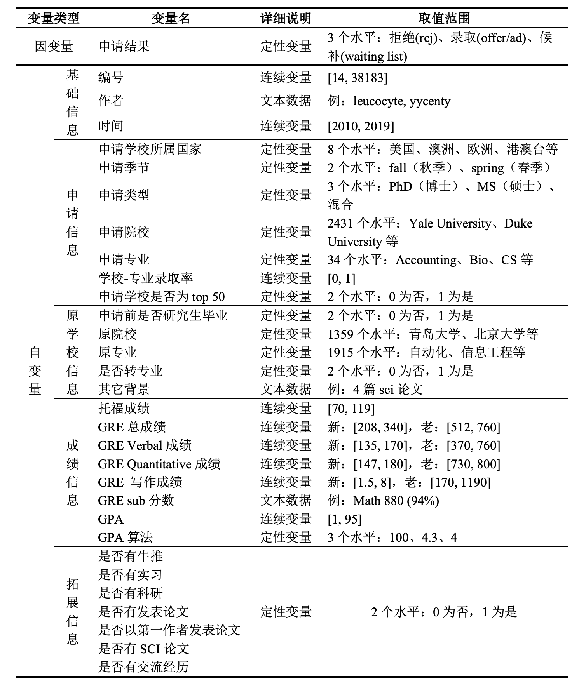
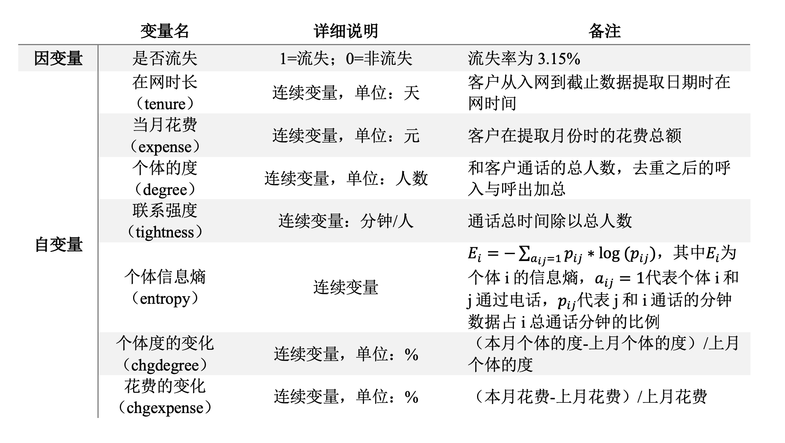

# 第7章：逻辑回归 {#ch7}

```{r setup, include=FALSE}
knitr::opts_chunk$set(echo = TRUE, message = F, warning = F, cache = T)
```

```{r message=FALSE,warning=FALSE}
### 数据准备 ###
# 清空工作空间
rm(list = ls())
```

## 教程案例

**案例背景**

近十年来，出国留学已经列入越来越多的同学的“未来规划清单”，根据教育部数据，2018年在我国出国留学人数66.21万人，同比增长8.83%。其中，自费留学人数占比最多，达59.63万人，占总留学人数的90%，国家公派3.02万人，单位公派3.56万人。从留学生选择留学国家/地区来看，留学目的地选择多样化，美国依旧是留学人群最喜欢的留学国家，英国增幅明显。数据显示，2019年留学生选择美国的人数占比下滑，为43%。而选择英国的群体占比在2019年大幅上升，占比41%，同美国差距正在缩小。但是，留学申请本身不是一件容易的事——不仅需要准备文书、英文考试，还要从上百个学校列表中选出合适自己的高校。若能最有效地提升背景，就更有可能获得“dream school”录取。

本章使用一个留学申请数据集，该数据来自某留学申请论坛的录取汇报结果，包含了15908条申请者的申请学校及录取与否信息。



```{r}
## 设置绘图主题
library(ggplot2)
plot_theme_pie <- theme(panel.background = element_rect(fill = rgb(255, 255, 255, maxColorValue = 255)),
                     plot.background = element_rect(rgb(255, 255, 255, maxColorValue = 255)),
                     axis.text = element_text(color = rgb(236, 241, 249, maxColorValue = 255)),
                     panel.grid.major = element_line(color = rgb(236, 241, 249, maxColorValue = 255)),
                     panel.grid.minor = element_line(color = rgb(236, 241, 249, maxColorValue = 255)),
                     plot.title = element_text(family = "Hei", face = "bold", size = 14),
                     legend.title = element_text(family = "Hei", face = "bold",size = 12),
                     legend.text = element_text(family = "Hei",size = 11))   # 饼图绘制主题
## 设置绘图主题
plot_theme <- theme(panel.background = element_rect(fill = rgb(255, 255, 255, maxColorValue = 255)),
                    plot.background = element_rect(rgb(255, 255, 255, maxColorValue = 255)),
                    axis.text = element_text(size = 12,family = "Hei"),
                    axis.text.x = element_text(size = 12, family = "Hei", face = "bold") ,
                    axis.text.y = element_text(size = 12, family = "Hei", face = "bold") ,
                    axis.ticks = element_line(color = rgb(236, 241, 249, maxColorValue = 255)),
                    axis.title = element_text(size = 13, family = "Hei"),
                    panel.grid.major = element_line(size = 1),
                    panel.grid.minor = element_line(color = rgb(236, 241, 249, maxColorValue = 255)),
                    plot.title = element_text(family = "Hei", face = "bold", size = 14),
                    legend.title = element_text(family = "Hei", face = "bold",size = 12),
                    legend.text = element_text(family = "Hei",size = 11))   # 其他图形绘制主题
```

### 任务一

读入数据`Data_Cleaning.csv`，命名为`descriptive`，将数据按照变量 index_origin（原始编号）由小到大排序。查看变量 offertype（录取结果） 的类型。为简化研究，将录取类型"AD小奖"、"Offer"、"AD无奖"统一为 "Admitted"，将录取类型"Rej"修改为"Rejected"，并删去缺失录取结果的样本。根据录取结果绘制饼状图，描述你观察到的结果。

```{r}
## 读入数据
descriptive <- read.csv("./data/Data_Cleaning.csv", header = T, stringsAsFactors = F) # 读取原始数据
descriptive <- descriptive[order(descriptive$index_origin),]  # 将数据按照变量index_origin（原始编号）排序

## 调整变量类型
descriptive$offertype[descriptive$offertype %in% c("AD小奖", "Offer", "AD无奖")] <- "Admitted"    # 不考虑奖学金，均归入“Admitted“（录取）
descriptive$offertype[descriptive$offertype == "Rej"] <- "Rejected"   
descriptive <- descriptive[ - which(descriptive$offertype == ""),]   # 删去缺失录取结果的样本

## 绘制饼状图
(piechart1 <- ggplot(descriptive, aes(x = factor(1), fill = factor(descriptive$offertype))) +
    geom_bar(position = "fill", width = 1) +
    scale_fill_manual("申请结果", values = c("grey","gold","skyblue")) +
    coord_polar(theta = "y") +
    labs(x = "", y = "", title = "\n录取类型") +
    plot_theme_pie)
```

数据中，录取的案例占一半以上，其中包括无奖录取、小奖录取和全奖录取，拒绝的申请占比为27.6%，还有少部分申请结果为Waiting List。在后续的建模中，将把Waiting List划分为拒绝类别。

### 任务二

我们先来看热门的申请学校（college_apply）。由于数据存在错误，我们需要对申请学校这一变量进行简单修正：将学校名"Texas A"、"M University"替换"Texas A&M University"，将"Washington University in St"、" Louis"替换为"Washington University in St. Louis"。随后，为了统一申请学校名称，我们要将学校缩写替换为全称，得到的新变量`College_apply_new` 并入原数据（注意：不考虑缩写字母的大小写差异，需要借助文件`美国大学缩写汇总.txt`）。根据统一后的学校名称，找出申请人数最多的10所热门学校。

```{r}
## 修正数据
descriptive$college_apply[descriptive$college_apply %in% c("Texas A", "M University")] <- "Texas A&M University"
descriptive$college_apply[descriptive$college_apply %in% c("Washington University in St", " Louis")] <- "Washington University in St. Louis"

## 统一学校名称
SuoXie <- read.table("./data/美国大学缩写汇总.txt", header = T)  # 读入常见的美国大学缩写汇总
college_apply_new <- NULL                                 # 设置初始值
college_low <- tolower(descriptive$college_apply)         # 不考虑大小写差异（下同）
suoxie_low <- tolower(SuoXie$ysuoxie)
for(i in 1:dim(descriptive)[1]){                          # 统一全称和缩写
  if (college_low[i] %in% suoxie_low) {
    college_apply_new[i] <- as.character(SuoXie$yquancheng[suoxie_low %in% college_low[i]]) 
  } else college_apply_new[i] <- descriptive$college_apply[i]
}
descriptive$College_apply_new <- college_apply_new        # 统一学校名称后的新变量

## 找出10大热门学校
(top10_college_apply <- names(sort(table(descriptive$College_apply_new),
                                          decreasing = T)[c(1:10)]))
```

### 任务三

找到10所热门学校后，下一步探究这些学校的录取情况。注意：为简化后续分析，**删掉所有录取结果为 WaitingList 的样本，只保留15908条数据**。

GPA（标准化考试成绩）是申请的关键之一。用变量`gpa`除以分制变量`gpa_measure`，再乘以4.0，可以将GPA标准化为四分制，得到新变量`Standardgap`并入原数据。考虑到不同排名的学校对学生成绩的要求差异，对申请学校进行排名划分。读入“QS大学排名前百（美国）.txt”，数据集前19所学校是世界前五十名的美国名校，据此将所有申请学校划分为"Top50"和"Others"两类，得到因子型的新变量`CollegeRankTop50`并入原数据。

接着，考查学业成绩`Standardgap`和学校排名`CollegeRankTop50`对录取结果的影响。绘制成绩与申请结果箱线图，并谈谈你的发现。注意，从现实出发，**只画出Standardgap>2.0的样本**。

最后，将成绩划分为"<=3.4", "3.4-3.55", "3.55-3.7", ">3.7"四类，得到新变量`gpa_dis`并入原数据。

```{r}
## 为简化后续分析，删掉录取结果为 WaitingList 的样本
descriptive <- descriptive[-which(descriptive$offertype == "WaitingList"),]

## 按学校名称匹配大学排名
universities <- read.table("./data/QS大学排名前百（美国）.txt",header = F, sep="\n")$V1     # 读入QS世界大学排名
top50university <- NULL   # 变量初始化
for(i in 1:dim(descriptive)[1]){                      
  top50university[i] <- descriptive$College_apply_new[i] %in% universities[1:19]  # 共19所美国名校进入世界前五十名
}

## 整理变量
collegerank <- rep("Others",dim(descriptive)[1])     
collegerank[top50university] <- "Top50"                      # 大学排名前50
descriptive$CollegeRankTop50 <- collegerank                  # 并入原数据

## gpa标准化
descriptive$Standardgap <- (descriptive$gpa/descriptive$gpa_measure)*4      # 将gpa统一整理为4分制
gpa_offertype <- descriptive[, c("Standardgap", "offertype", "CollegeRankTop50")]  
gpa_offertype$offertype <- factor(gpa_offertype$offertype, levels = c("Admitted", "Rejected"),
                                 labels = c("录取","被拒"))                 #  调整因子水平
gpa_offertype$CollegeRankTop50 <- factor(gpa_offertype$CollegeRankTop50, levels = c("Top50","Others"))

## 画图
(boxplot1 <- ggplot(gpa_offertype, aes(x = factor(CollegeRankTop50), y = Standardgap, fill = factor(offertype))) +
    geom_boxplot(show.legend = T, varwidth = T) +
    scale_fill_manual("申请结果", values = c("grey", "gold")) +    # 按照申请结果填色 
    scale_y_continuous(limits = c(2, 4),breaks = seq(2, 4, by = 0.2))+     # 不考虑gpa<2.0的样本
    labs(x = "申请学校的世界排名", y = "GPA", title = "成绩与申请结果") +
    plot_theme)

## 成绩分段
descriptive$gpa_dis <- cut(descriptive$Standardgap, breaks = c(0, 3.4, 3.55, 3.7, Inf),
                           labels = c("<=3.4", "3.4~3.55", "3.55~3.7", ">3.7"))

```

结论：申请 Top50 学校时，录取的学生平均GPA（中位数）较高。申请其他学校时，GPA差异不明显。而从波动程度来看，无论是申请Top50还是其他学校，录取同学的GPA的差异都比未录取的GPA差异大，说明高GPA不一定是录取的必要因素。

### 任务四

托福成绩也是申请时至关重要的一环。将变量`toefl`转化为数值变量，随后划分为"<=98", "98-102", "102-106", ">106"四个分数段，得到因子型的新变量`toefl_dis`并入数据。计算不同排名的学校在各分数段的录取率，绘制复式条形图。注意标注出录取率百分数，并添加一条平均录取率作为参考线。从图中你能得到什么结论？

```{r,warning=F}
## 整理托福成绩
descriptive$toefl <- as.numeric(descriptive$toefl)    # 将托福成绩信息变为数值型
descriptive$toefl_dis <- cut(descriptive$toefl, breaks = c(0, 98, 102, 106, Inf),
                             labels = c("<=98", "98~102", "102~106", ">106"))

## 计算录取率
ifadmitted <- ifelse(descriptive$offertype == "Admitted",1,0)
admittedPct <- aggregate(ifadmitted, list(descriptive$toefl_dis, descriptive$CollegeRankTop50), mean)
colnames(admittedPct) <- c("TOEFL","学校排名","admittedpct")
admittedPct$学校排名 <- factor(admittedPct$学校排名,levels = c("Top50","Others"))

### 画图
(barplot2 <- ggplot(admittedPct, aes(TOEFL, admittedpct, fill = 学校排名)) + 
  geom_bar(stat='identity',position='dodge') +
  scale_fill_manual("学校排名", values = c("grey", "gold")) +    # 按照申请结果填色 
  labs(x="", y="", title="\n不同托福成绩的平均录取率") +
  geom_text(label = paste(round(admittedPct[order(admittedPct$TOEFL), 3], 2)*100, "%", sep=''), 
            colour = "black", position = position_dodge(1), size = 3, vjust = - 0.8)  +
  geom_hline(aes(yintercept = mean(ifadmitted)), col = "orange", lwd = 1)+
  geom_text(label = paste(round(mean(ifadmitted), 2)*100, "%", sep=''), 
            colour = "orange",x = 5.4, y = 0.7, size = 5.7, vjust =  - 0.5) + 
  plot_theme)
```

结论：对于排名靠前的学校来说，托福成绩越高，平均录取率越高。

### 任务五

申请博士与硕士需要做哪些准备呢？我们来探究硬件条件对于不同学位（type）申请的影响。硬件条件共包括6个变量："research"、"paper"、"first"、"sci"、"rl"、"intern"和"exchange"，依次代表科研、论文、一作、 SCI论文、牛推、实习和交换。对这些变量取绝对值后，得到6个0-1变量，0代表不具备某种硬件条件，反之为1。

下面，绘制出硬件条件与申请学位的矩阵图。矩阵的每个元素代表对应学位的所有申请者中，提到自己具备对应硬件条件的人数比例。以（1, 1）元素为例，表示硕士申请者中，提到自己有过交换出国经历的比例为2.8%。注意：利用R包`data.table`和`reshape`能够简化矩阵计算；横纵坐标各水平的先后顺序与下图保持一致。从图中你能得到什么结论？

```{r}
library(reshape)
## 预处理
descriptive$first <- abs(descriptive$first)
descriptive$sci <- abs(descriptive$sci)

## 录取情况与硬件条件
extra_offertype <- descriptive[, c("rl", "intern", "research", "paper",
                                   "first", "sci", "exchange", "type")]
tab1 <- table(extra_offertype$type) 
extra_offertype <- melt(extra_offertype, id = "type")      # 短表变长表
count <- subset(extra_offertype, extra_offertype$value == 1)  
tab2 <- table(count$type, count$variable)                  # 申请硕博拥有某硬件条件的情况
count_plot <- melt(rbind(tab2[1, ]/tab1[1], tab2[2, ]/tab1[2],  tab2[3, ]/tab1[3]))  # 学位×硬件条件
count_plot$X1 <- factor(count_plot$X1, levels = c(1, 2, 3),        # 调整变量因子水平
                       labels = c("MS", "PhD", "混合"))
count_plot$X2 <- factor(count_plot$X2, levels = c("research","paper","first",
                                                  "sci","rl","intern","exchange"),
                           labels = c("科研", "论文", "一作", "SCI论文", "牛推", "实习", "交换"))

## 绘制硬件条件与申请学位的矩阵图
(matrix1 <- ggplot(count_plot, aes(x = X1, y = X2, label = value, fill = value)) + # 画图
    geom_tile(show.legend = F) +    
    geom_text(label = paste(round(count_plot$value, 3)*100, "%", sep = ''),
              color = "black", family = "Hei", size = 4.5) +
    scale_fill_gradient("count", low = "white", high = "lightCoral") +
    labs(x = "申请学位", y = "硬件条件", title = "") + plot_theme)
```

结论：申请硕士实习更加重要，申请博士论文更加重要，而混合申请介于两者之间。

### 任务六

最后，我们将申请结果`offertype`作为因变量（录取=1，被拒=0），在训练集上建立逻辑回归模型，选取的变量如下：

```{r echo=F}
descriptive$offertype <- as.factor(ifelse(descriptive$offertype=="Admitted", T, F))  # 调整为因子变量

## 回归建模
(formula <- paste0("offertype ~ ",
                   paste0(c("season","type","cross",colnames(descriptive)[c(26:32,34,36,37)]),collapse = " + "))) 
```

对数据进行训练集与测试集的划分（0.8: 0.2）。以上述方程在训练集数据上建立逻辑回归模型，对模型进行变量选择（使用AIC准则），并对模型结果给出合理的解读。

```{r}
## 抽取训练集
set.seed(123)    # 随机数种子
nsample <- sample(x = dim(descriptive)[1], size = dim(descriptive)[1]/5, replace = F)

## 重新划分训练集和测试集
descriptive_train <- descriptive[-nsample, ]  
descriptive_test <- descriptive[nsample, ]   

## 建立逻辑回归模型
myglm0 <- glm(formula, family = binomial(), data = descriptive_train)  # 逻辑回归
myglm <- step(myglm0, trace = F)     # AIC准则逐步回归
summary(myglm)    # 查看回归结果
```

经过AIC准则选择后，模型留下了对申请结果影响显著的变量。根据模型形式的理解，逻辑回归模型的系数体现了因变量分别取1和0的可能性大小。例如，对于申请类型而言，其基准组为只申请硕士（MS），在控制其他变量不变的情况下，申请PhD的同学被录取的可能性比只申请硕士的同学录取可能性大；同样地，控制其他变量不变的情况下，有一作论文发表、海外交流经历的同学比没有相关经验的同学更易获得录取；从GPA和托福成绩这两个硬性指标来看，随着成绩区间档位的上升，获得录取的可能性增大，因此提高提高英语考试成绩是申请季稳中求胜的“法宝”。

### 任务七

用逐步回归后的模型对测试集的申请结果进行预测，并利用R包pROC绘制出ROC曲线图，根据曲线对模型进行评价。

```{r}
library(pROC)
# 进行预测
pred <- predict(myglm, descriptive_test, type="response")
par(family='STXihei')
# 绘制ROC曲线
plot.roc(descriptive_test$offertype, pred, col = "dodgerblue", print.auc=TRUE,
         auc.polygon=TRUE, auc.polygon.col="#f6f6f6", xlab = "FPR",ylab = "TPR", main = "预测ROC曲线")  
```

根据曲线的结果，AUC值（即ROC曲线下的面积）为0.754，说明该模型对数据的预测效果较好。

## 习题答案

**案例背景**

社交电商在运营中有一个非常重要的工作是留存客户，通过社交电商平台获取用户和积累了大量的老客户以后，可以专门针对会员建立会员群，以提升这部分群体的粘性和复购率，帮助社交电商平台提升销量。为了探究影响客户流失的因素，以客户是否流失为因变量，建立一套系统的客户流失预警模型，数据来自国内某社交电商平台。建模时使用sampledata.csv，预测时使用preddata.csv，所有的自变量来自当月，因变量（是否流失）来自下一个月，具体的变量介绍如下表所示。



### 任务一

读入数据`sampledata.csv`和`preddata.csv`，分别命名为`trainset`和`testset`，并用`summary`函数展示训练集数据的情况。

```{r}
trainset <- read.csv("./data/sampledata.csv", fileEncoding = "utf-8", header = T)
testset <- read.csv("./data/preddata.csv", fileEncoding = "utf-8", header = T)

summary(trainset)  ## 数据概览
```

### 任务二

将因变量`churn`转换为因子型变量，建立逻辑回归模型，输出模型的结果并对结果进行解读。

```{r}
trainset$churn <- as.factor(trainset$churn)  ## 因变量转换为因子型
fit <- glm(churn ~ tenure+expense+degree+tightness+entropy+chgdegree+chgexpense, 
           family = binomial(link = logit), data = trainset)  ## 拟合逻辑回归模型
summary(fit)  ## 输出模型估计结果
```

根据建模的结果，可以看出，在保持其他变量不变的情况下，用户的在网时长越长，其流失的可能性就越低；当月的花费越高，流失的可能性越低；用户的联系强度越高，流失的可能性也越低。

### 任务三

将任务二中的参数估计结果应用到`predata`中，给出`predata`中每个用户预测的流失概率值，绘制预测的ROC曲线，并计算对应的AUC值。

```{r}
library(pROC)
## 将模型结果应用到新的数据集上
fitted.results <- predict(fit,newdata = testset, type = 'response')
## 绘制ROC曲线 & 计算AUC值
library(ROCR)
testset$churn <- as.factor(testset$churn)
par(family='STXihei')
plot.roc(testset$churn, col = "dodgerblue", print.auc=TRUE,
         auc.polygon=TRUE, auc.polygon.col="#f6f6f6", xlab = "特异度",ylab = "敏感度",
         fitted.results, main = "预测ROC曲线")  
```

绘制ROC曲线如上所示，计算得到AUC值为0.617，模型在测试集上的预测表现较好。
