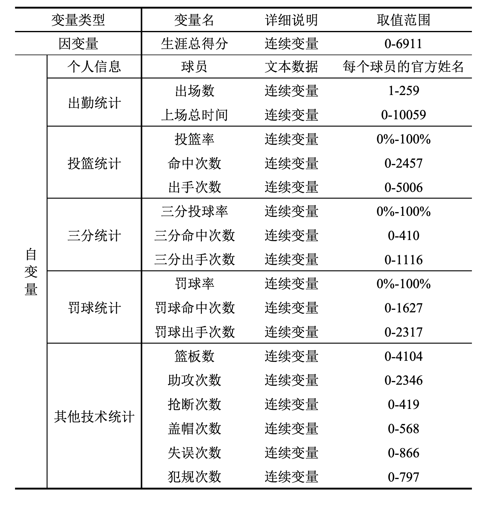
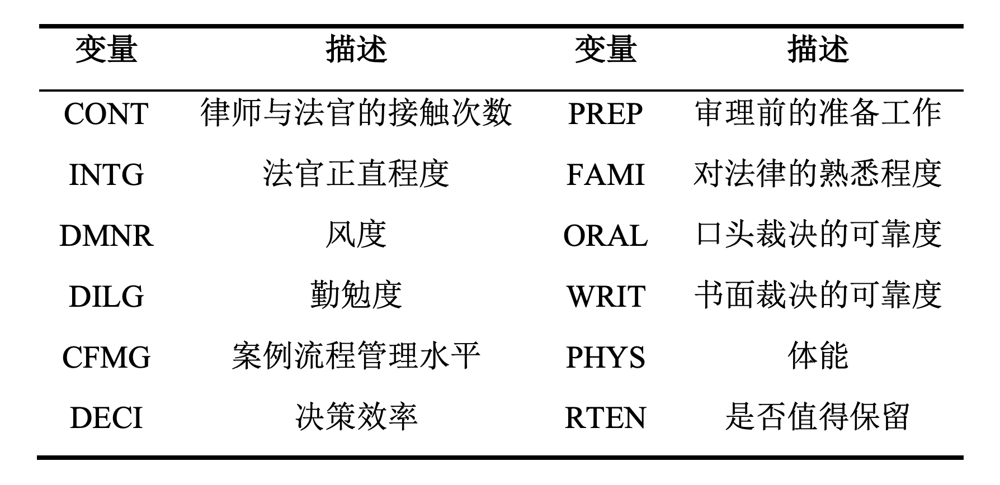

# 第8章：降维分析 {-#ch8}

```{r message=FALSE,warning=FALSE}
### 数据准备 ###
# 清空工作空间
rm(list = ls())
```

## 案例引入 {-}

NBA，全称为美国职业篮球联赛(National Basketball Association)，作为美国四大职业体育联盟之一，在美国本土，在四大联赛中的排名绝非第一；而就全球而言，尤其是中国，其普及率和收看率，则是远远高于其他三大联盟。

NBA作为商业联盟，不管是联盟还是球队，最关心的问题还是盈利，其球队市值估价也逐年提高。据《福布斯》2019年发布的NBA球队市值，30支NBA球队的估值首次全部达到或超过12亿美元，平均市值为19亿美元，较去年增长13%，是三年前的3倍，其中，纽约尼克斯达到40亿美金，是所有球队中最高的。对于NBA球队来说，其收入包括门票收入、广告收入等，而球队支出中，则有一大部分在于球员薪金。

那么，自由球员在自由市场中的价值，具体表现为其下一份合同的薪金大小，是由哪些因素决定的？根据经验，主要的因素应该包括其在球场上的表现以及其展现的天赋和能力，再或者是对胜利的贡献。对于球队经理来说，需要主观地综合考虑多方面的因素，给出合适的合同。因此对球员薪金影响因素的量化分析，可以更合理地估计出球员在各个方面的水平与价值，对应合理的薪金合同，也有助于球队挑选更具性价比的球员，组建更为合理的阵容。这对球队战绩的提升、球队运营收入的增益，有着重要的意义。

本章案例数据收集自截至2019年NBA球员季后赛总得分和每个球员的比赛详细数据。该数据收集了2448条NBA职业篮球运动员的各项比赛数据，其中包含勒布朗·詹姆斯、迈克尔·乔丹、科比·布莱恩特等多位全能巨星球员的投篮、三分球、罚球、助攻、抢断次数和季后赛总得分等18个变量信息。



## 8.1 主成分分析{-}

### 读入数据并绘制相关系数矩阵 {-}

读入数据`NBA.xlsx`，命名为nba，并将第2-18个变量提取为一个新的数据框，命名为`predictor`。绘制变量之间的相关系数矩阵图

```{r}
library(psych)
library(readxl)
nba <- read_excel("./data/NBA.xlsx")
predictor <- nba[2:18]

## 变量间相关系数
M <- cor(predictor)
```

```{r ch8-plot1}
par(family='STXihei')
corrplot::corrplot(M, tl.srt = 60,tl.col = "black")
```


根据变量的相关系数图可以看出，部分变量之间的正相关性较强，例如出场数和上场总时间，命中次数和出手次数等。


### 选择主成分个数 {-}

使用`psych`包中的`scree()`函数，绘制崖底碎石土，选择合适的主成分个数。scree()函数中，通过指定参数factors和pc的取值，生成主成分分析或因子分析的崖底碎石图，hline参数取值为绘制水平直线的高度，默认值为1，设置为负数则不绘制水平线。scree()函数会返回根据特征值绘制的崖底碎石图，同时返回特征值向量，因此可以使用该返回值计算累计方差贡献率。

```{r ch8-plot2}
## 主成分分析选择因子数目
par(family='STXihei')
result1 <- scree(predictor, factors = F, pc = T,  main = "主成分分析崖底碎石图", hline = -1)
```


```{r}
## 计算累计方差贡献率
cumvar <- round(cumsum(result1$pcv)/sum(result1$pcv),2)
cat('前三个主成分累计方差贡献率为：', cumvar[1:3])
```

根据崖底碎石图的拐点，结合主成分解释总体方差的比例（约为80%），选择主成分个数为3。

### 提取主成分与结果解读 {-}

根据任务二中确定的主成分个数，提取主成分，并对结果进行解读。

```{r}
## 提取主成分
pc <- principal(predictor, nfactors = 3)
pc
```

R的输出结果中，前三列为三个成分的载荷，它是指观测变量与主成分的相关系数，这里需要注意，载荷系数的正负本身没有意义 ，但是不同载荷系数之间的正负对比是有意义的；h2栏指主成分对每个原始变量的方差贡献率，即主成分对每个变量的方差解释度，由每个主成分的载荷平方求和得到，例如对于出场数，三个主成分一共解释了86%的方差；u2栏指成分唯一性，由1-h2计算得到，即方差无法被主成分解释的比例；最后一列com为主成分在每个变量上的Hoffman's复杂度指数，$X_i$对应的复杂度由$\frac{\left(\Sigma_{k} \rho_{k i}^{2}\right)^{2}}{\Sigma_{k}\left(\rho_{k i}\right)^{4}}$计算得到，其中$\rho_{k i}$为第k个主成分与变量$X_i$的因子载荷，该指数表示前k个主成分与第i个变量之间的综合相关性大小，值越大表示整体相关性越强。

从代码结果的最后一个输出表可以看出，第一主成分解释了出场数85%的方差，第三主成分解释了投篮率80%的方差，第二主成分则分别解释了三分命中次数和三分出手次数90%的方差。代码结果中的累计贡献率显示，前三个主成分的累计贡献率达到了80%，因此使用这三个主成分可以很好地概括这组数据。

利用主成分分量的值可以对各个主成分进行解释，第一主成分的三分投球率分量为负值，其余都为正值，除了投篮率、罚球率、三分投球率、三分命中次数等表示“命中”占比的指标外，其余分量大多数都大于0.5，因此第一主成分反映球员的比赛活跃与主动程度，可以称为**场内活跃因子**。第二大主成分在三分球的命中次数和出手次数上分量高达90%，在2010-2018的8个NBA赛季中，球员的三分球得分尝试大幅度增加，因为球队都不约而同地得出了一个结论：根据加入胜率的计算，三分球投篮尝试（特别是从角落投出）在统计数据上让球队赢得比赛的可能性增加20%到35%。因此，我们可以称第二大主成分为**胜率加成因子**。第三大主成分在投篮（命中）率、罚球（命中）率和三分投球（命中）率分量较大，由于命中率体现了球员的篮球技术水平，第三主成分则可以被称为**技术水平因子**。

### 计算主成分得分 {-}

通过`principal()`函数返回的`weights`对象，可以得到每个变量的主成分得分系数，从而将主成分表示为变量的线性组合形式。在`principal()`函数的基础上，添加参数`score = TRUE`，即可以获得所有球员样本在三个主成分上的得分，通过这个得分，可以从三个角度（场内活跃因子、胜率加成因子、技术水平因子）对球员的综合实力进行评价。请计算主成分得分系数，并输出前六个样本的主成分得分，对结果进行适当解读。

```{r}
round(unclass(pc$weights), 2)  # 计算主成分得分系数
```

```{r}
## 计算主成分得分
pc <- principal(predictor, nfactors = 3, scores = TRUE)
head(pc$scores)
```

利用如下公式可得到主成分得分，以第一主成分为例：

$PC_1$=0.09 * 出场数 + 0.1 * 上场总时间-0.02 * 投篮率 + 0.12 * 命中次数 + 0.11 * 出手次数-0.15 * 三分投球率-0.1 * 三分命中次数-0.1 * 三分出手次数-0.03 * 罚球率 + 0.12 * 罚球命中次数 + 0.14 * 罚球出手次数 + 0.15 * 篮板数 + 0.07 * 助攻次数 + 0.02 * 抢断次数 + 0.12 * 盖帽次数 + 0.04 * 失误次数 + 0.12 * 犯规次数

以第一个球员为例，他的场内活跃因子和胜率加成因子得分较高，说明他是一位在比赛场上主动进攻类型的球员，但是他的技术水平因子得分较低，因此还是需要多加练习，提高自己的投篮命中率，从而获得更多分数。


## 8.2 因子分析{-}

### 选择合适的公共因子数目 {-}

在进行因子分析之前，需要对数据进行标准化，再计算协方差矩阵；或等价地，使用原始数据的相关系数矩阵作为因子分析函数的输入。利用scree()函数绘制因子分析的崖底碎石图，结合累计方差贡献率（由fa()函数输出）等指标，选择合适的公因子数目。

```{r}
## 因子分析
cov <- cov(nba[,2:18])
## 转换为相关系数矩阵（等价于标准化后数据的协方差矩阵）
cor <- cov2cor(cov)
```

```{r ch8-plot3}
## 选择因子数目
par(family='STXihei')
result2 <- scree(cor, factors = T, pc = F, main="因子分析崖底碎石图", hline = -1)
```


利用scree()函数绘制因子分析的崖底碎石图，结合累计方差贡献率（由fa()函数输出）等指标，设置公因子数为3。

### 提取公共因子 {-}

使用NBA季后赛球员数据来进行公共因子的提取，公因子数目根据任务五的结果所得。使用最大似然法提取未旋转的因子，对提取公共因子的结果进行解读。

```{r}
## 提取公共因子
fa(cor, n.obs = 2448, nfactors = 3, rotate = "none", fm = "ml")
```

得到结果后，如何解读公共因子的含义呢？解释公因子$F_i$时，可以通过对载荷系数的绝对值较大的输入来解释，与主成分分析的R程序结果类似，这里同样需要注意，载荷系数的正负本身没有意义，但是不同载荷系数之间的正负对比是有意义的。以上面的结果为例，我们取公共因子的个数为3，3个公共因子反映的原始变量信息已占总信息的73%。查看输出的因子载荷矩阵A，以ML1对应的列（第一个公共因子的载荷向量）为例，除了投篮率、三分球技术指标、罚球率和盖帽次数外，其余各数值都接近或大于0.8，这表示其余的变量可以来解释公因子$F_1$，或者说$F_1$主要反应这些变量的信息。观察第二个公共因子，其载荷没有0.8左右较大的值，虽然也可以根据相对大小按照以上想法解释，但是容易使公共因子的意义含糊不清，因此我们将介绍因子旋转后的因子载荷矩阵，其实际含义将更加明显。

### 正交旋转 {-}

当直接提取出的公共因子的典型代表变量不是非常突出时，容易使公共因子的实际意义含糊不清，不利于对因子进行解释，为此需要对因子载荷矩阵进行旋转变换，使得各因子载荷矩阵的每一列各元素的平方按列向0或1两极转化，达到其结构简化的目的。在NBA季后赛球员得分的案例中，我们使用正交旋转进一步提取因子，对新的结果进行解读。

```{r}
## 因子旋转
fa <- fa(cor, n.obs = 2448, nfactors = 3, rotate = "varimax", fm = "ml")
fa
```

因子旋转后，第一个公共因子的因子载荷旋转后弱化了投篮率和三分投球率的意义，使得第一公因子主要解释了命中、出手次数和罚球的命中、出手次数，反映球员的比赛活跃与主动程度，可以称为**场内活跃因子**；第二个公共因子比旋转前加强了篮板数、盖帽次数、命中次数这几个变量的含义，因此可以更清晰地反映球员的**技术水平因子**；第三个公因子与旋转前相比，强化了三分命中次数和三分出手次数的解释，主要反映了三分球相关的信息，是球员对于整场球的**胜算率加成因素**。这和主成分分析得到的结论是类似的，由于因子分析结果进行了因子旋转，第二个和第三个公因子的共性方差相对大小发生了变化，因此公因子的顺序和旋转之前也略有区别。

### 计算因子得分 {-}

对`fa()`返回的对象使用`factor.scores()`函数，可以得到因子得分矩阵，通过这个得分，可以从几个公因子的角度对球员的综合实力进行评价。计算NBA数据的巴特莱特因子得分，设置参数`method = 'Bartlett'`，查看得分矩阵的前六行。此外，在`fa()`函数返回的结果中，还可以得到得分系数（标准化的回归权重），储存在`weights`元素中。对于NBA数据集，输出对载荷矩阵进行旋转后得到的因子得分权重，并进行解读。

```{r}
my_score <- factor.scores(nba[,2:18], fa, method="Bartlett")
head(my_score$scores)
```

以第一个球员的因子得分为例，其在场内活跃度最高，三分球出手胜率加成也较好，但是命中率技术水平欠佳。

```{r}
round(fa$weights,2)  # 因子得分权重
```

根据因子得分权重的结果，每一个公共因子都可以表示为原变量的线性组合，由此得出因子得分函数。进一步地，把每个样本的观测值逐个代入因子得分函数后，即可得到样本的因子得分值。

### 因子分析结果可视化（选做）{-}

若有2-3个公因子，还可以将每个样本的因子得分绘制在直角坐标系中，从而更清晰地看出样本的散布情况。这里以NBA数据为例，提取3个公因子，将2448个观测的因子得分散点图绘制在三维画布上如下所示。

```{r}
## 3个公因子可视化因子得分
fa1 <- fa(cor, n.obs = 2448, nfactors = 3, rotate = "varimax", fm = "ml")
my_score <- factor.scores(nba[,2:18], fa1, method="Bartlett")
s <- data.frame(my_score$scores)
```

```{r eval=F}
## 绘制3D散点图（在命令行执行，用浏览器打开结果）
library(plotly)
library(magrittr)
plot_ly(x=s$ML1, # x axis
        y=s$ML2,  # y axis
        z=s$ML3,         # z axis
        type = "scatter3d", size = 0.5) 
```


## 习题答案 {-}

### 题目 8.1 {-}

R中自带的数据列表`Harman23.cor`包含了305个女孩的8个身体测量指标，列表的`cov`对象是原始数据及的相关系数矩阵。使用该相关系数矩阵，对8个身体指标进行主成分分析，用较少的变量替换这些原始的身体指标，并对结果进行解读。

```{r}
library(psych)
my_cov <- Harman23.cor$cov
```

```{r ch8-plot4}
## 主成分分析选择因子数目
par(family='STXihei')
hw1 <- scree(my_cov, factors = F, pc = T,  main = "主成分分析崖底碎石图", hline = -1)
```


```{r}
## 提取主成分
pc <- principal(my_cov, nfactors = 2)
pc

```

### 题目 8.2 {-}

R中自带的数据集`USJudgeRatings`包含了律师对美国高等法院法官的评分。数据框包含了43个观测、12个变量，变量表如下所示。


请使用主成分分析的方法，用较少的变量总结从`INTG`到`RTEN`这11个变量，使得这些主成分可以尽可能保留原始变量的信息，对结果进行解读，并计算43个观测样本的主成分得分。

```{r}
USpredictor <- USJudgeRatings[, -1]
```

```{r ch8-plot5}
## 主成分分析选择因子数目
par(family='STXihei')
hw2 <- scree(USpredictor, factors = F, pc = T,  main = "主成分分析崖底碎石图", hline = -1)
```


```{r}
pc2 <- principal(USpredictor, nfactors = 1, scores = T)
pc2
```

```{r}
head(pc2$scores)
```

### 题目 8.3 {-}

R中自带的数据列表`ability.cov`提供了六个心理学测验的数据，包括112个参与者的观测值和6个变量：非语言的普通智力测验（general）、画图测验（picture）、积木图案测验（blocks）、迷宫测验（maze）、阅读测验（reading）和词汇测验（vocab），该列表的cov对象为变量间的协方差矩阵。使用因子分析的方法，选择合适的公因子数目，将6个变量转化为计较少的一组潜在心理学因素，解释不同公因子的含义。

```{r}
cov_hw3 <- ability.cov$cov
corr <- cov2cor(cov_hw3)
```

```{r ch8-plot6}
## 选择因子数目
par(family='STXihei')
result2 <- scree(corr, factors = T, pc = F, main="因子分析崖底碎石图", hline = -1)
```


```{r}
## 提取公共因子
fa_hw2 <- fa(corr, n.obs = ability.cov$n.obs, nfactors = 2, rotate = "none", fm = "ml")
fa_hw2
```

```{r}
## 因子旋转
farot_hw2 <- fa(corr, n.obs = ability.cov$n.obs, nfactors = 2, rotate = "varimax", fm = "ml")
farot_hw2
```
